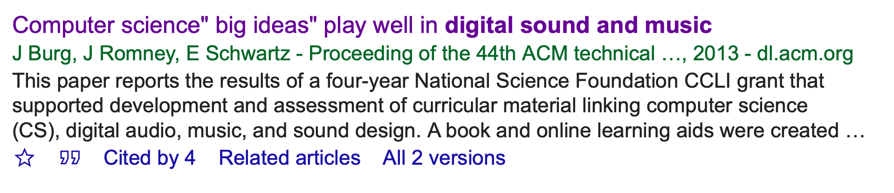
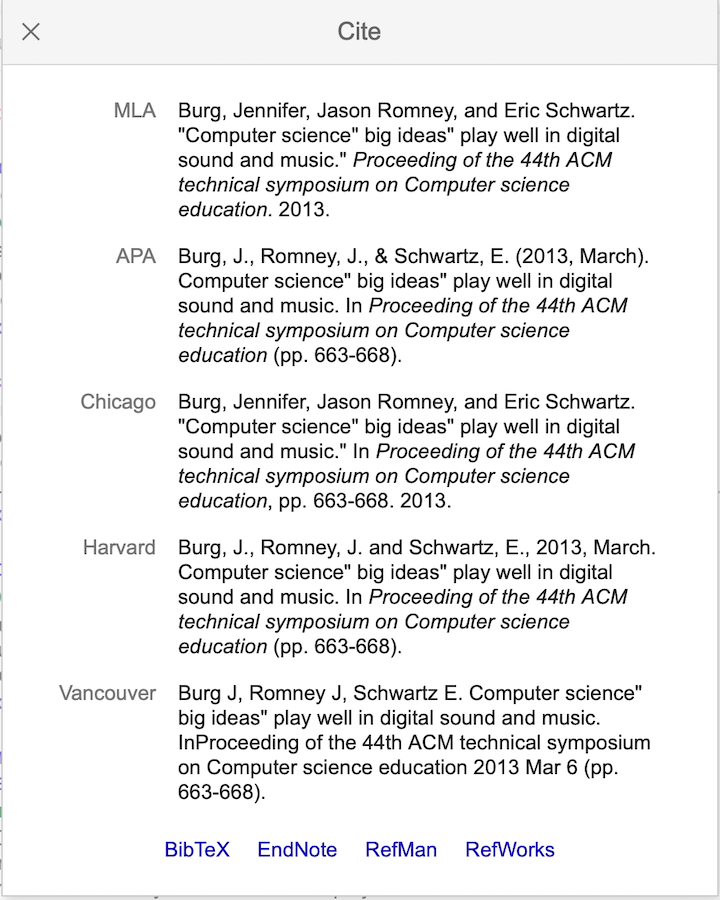
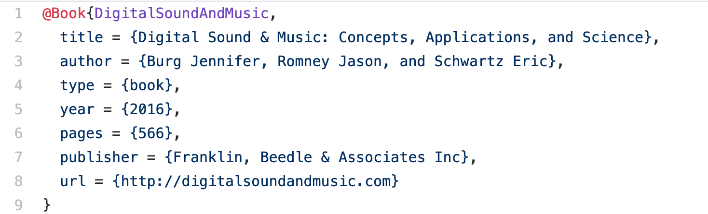
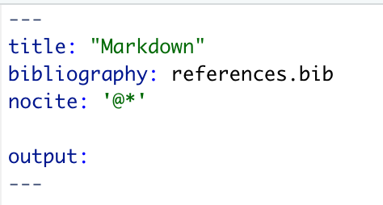
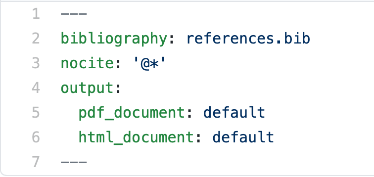

Cite in Markdown

***
[**CLICK HERE**](https://github.com/benmarwick/atom-for-scholarly-writing-with-markdown) 
for more documentation

###  Collecting references to cite in Markdown document

There are two simple methods from getting scholarly references into your Markdown document: with Google Scholar, or with Zotero.

1. search for article using Google Scholar

2. select the quote icon under the article being cited

3. click on Bibtex option in the following popup

4. Select and copy text

5. Paste the text into a .bib file 

6. Save the .bib file into the same directory as the .Rmd file

&nbsp;

### Adding citations into the Markdown text

Make sure the .bib file is in the same directory as the .md or .Rmd file

Then in the Markdown document,

7. Use the YAML front matter to Link the .bib file to your Markdown document

&nbsp;

#### Convert Markdown to PDF or HTML

8. Use the YAML front matter to add the following outputs: `pdf_document` and/or `html_document`

Now when you knit the markdown document, you should see that the output contains your citations in the footnote. 

### References

https://github.com/benmarwick/atom-for-scholarly-writing-with-markdown

