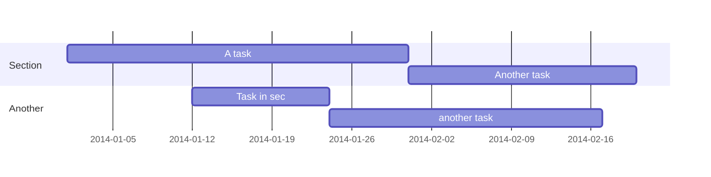

-----------------------------------

## Overview

Academic provides a fantastic framework, which creates visually pleasing websites using the Hugo static site generator. Academic writes rich content using Markdown, LaTex math, and Shortcodes (plugins). The following introduction post offers an overview of various formatting options. 


## Sub-headings

```
## Heading 2
### Heading 3
#### Heading 4
##### Heading 5
###### Heading 6
```

-----------------------------------

## Emphasis

```
**bold**
_italics_
```

-----------------------------------

## Lists

### Ordered 

```
1. First
2. Second
```

### Unordered

```
* First
* Second
```


### To Do

```
- [x] Write math example
- [x] Write diagram example
- [ ] Do something else
```

- [x] Write math example
- [x] Write diagram example
- [ ] Do something else

-----------------------------------

## Images

figure within a page’s folder:

```
{ {< figure src="image.jpg" title="A caption" lightbox="true" >} }
```





-----------------------------------

## Videos

### Youtube

```
{ {< youtube w7Ft2ymGmfc >} }
```


### Local Video

```
{ {< video src="my_video.mp4" controls="yes" >} }
```

-----------------------------------

## Color

```
<div style="color:blue;"> This text will be blue </div>
```


<div style="color:blue;"> This text will be blue </div>


-----------------------------------

## Links

```
[I'm a link](https://www.google.com)

[A publication]()
```

[I'm a link](https://www.google.com)

[A publication]()

  
-----------------------------------

## Emojis

```
I : heart : Elon Musk 
: rocket : : rocket : : rocket : : rocket :
```

I :heart: Elon Musk 

:rocket: :rocket: :rocket: :rocket: 

-----------------------------------

## Icons

```
{ {< icon name="terminal" pack="fas" >} } Terminal
{ {< icon name="python" pack="fab" >} } Python  
{ {< icon name="r-project" pack="fab" >} } R
```

 Terminal  
 Python  
 R


-----------------------------------

## Blockquote

```
> This is a blockquote.
```

> This is a blockquote.

-----------------------------------

## Highlight

```
This is a { {< hl >} } highlighted quote { {< /hl >} }.
```

This is a  highlighted quote .

-----------------------------------

## Footnotes

```
I have more [^1] to say.

[^1]: Footnote example.
```

I have more [^1] to say.

[^1]: Footnote example.

-----------------------------------

## Embed Documents

```
{ {< gdocs src="https://docs.google.com/document/">} }
```


-----------------------------------

## Diagrams

* toggle the diagram option in `config/_default_params.toml` file 
* or add diagram: true to the page front matter




-----------------------------------

## Twitter

```
{ {< tweet 666616452582129664 >} }
```

-----------------------------------

## Math

```{bash}
$$\gamma_{n} = \frac{ 
\left | \left (\mathbf x_{n} - \mathbf x_{n-1} \right )^T 
\left [\nabla F (\mathbf x_{n}) - \nabla F (\mathbf x_{n-1}) \right ] \right |}
{\left \|\nabla F(\mathbf{x}_{n}) - \nabla F(\mathbf{x}_{n-1}) \right \|^2}$$
```

```{bash}
$$f(k;p_0^*) = \begin{cases} p_0^* & \text{if }k=1, \\\\
1-p_0^* & \text {if }k=0.\end{cases}$$
```

$$\gamma_{n} = \frac{ 
\left | \left (\mathbf x_{n} - \mathbf x_{n-1} \right )^T 
\left [\nabla F (\mathbf x_{n}) - \nabla F (\mathbf x_{n-1}) \right ] \right |}
{\left \|\nabla F(\mathbf{x}_{n}) - \nabla F(\mathbf{x}_{n-1}) \right \|^2}$$


$$f(k;p_0^*) = \begin{cases} p_0^* & \text{if }k=1, \\\\
1-p_0^* & \text {if }k=0.\end{cases}$$


-----------------------------------

## Table

```
| Command           | Description                    |
| ------------------| ------------------------------ |
| `hugo`            | Build your website.            |
| `hugo serve -w`   | View your website.             |
```


| Command           | Description                    |
| ------------------| ------------------------------ |
| `hugo`            | Build your website.            |
| `hugo serve -w`   | View your website.             |


-----------------------------------


Supplementary notes can be added here, including [code and math](https://sourcethemes.com/academic/docs/writing-markdown-latex/).
